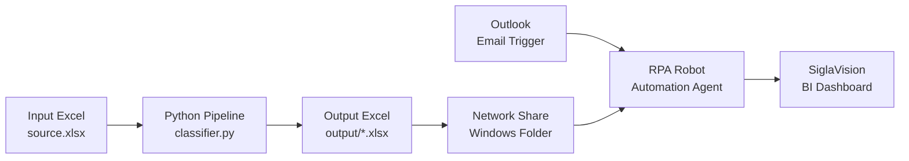

# Executive Overview

## Purpose

**Tech Radar Classifier** automates labeling of corporate Technology Radar scenarios along two axes:

1. **Quadrant** — technology domain (24 classes, e.g. IoT, import substitution, industrial automation).
2. **Block** — business process / organizational owner (16 classes, e.g. Production Director block, Finance block).

> 💬 **RU:** Система решает задачу двухуровневой автоматической разметки сценариев Technology Radar. Quadrant отвечает на вопрос «к какой технологии относится сценарий», block — «какому блоку бизнес-процессов он принадлежит». Это не generic text classifier: таксономия жёстко задана списками в `rules.py` (24 + 16 классов). Любое расширение таксономии — изменение кода и пересборка прототипов.

---

## Business Context

The radar holds hundreds of technology scenarios in Excel. Manual quadrant/block labeling is slow and inconsistent. The classifier:

- accelerates initial labeling and audit;
- returns confidence and top-3 alternatives for human review;
- supports batch export and write-back to `data/source.xlsx`.

Gold quality reference: manual markup in `data/source_16.06.xlsx`. Automation does not replace review when confidence is low.

> 💬 **RU:** Бизнес-контекст — массовая разметка Excel-радара с возможностью ручной проверки. Эталон качества — `source_16.06.xlsx`; автоматика не отменяет review при низком confidence (см. `output/low_confidence_records.csv` после `update_source_xlsx.py`). Типичная ошибка — массово перезаписывать source без проверки diff-отчёта: используйте `compare_and_update.py`, где ручная разметка всегда побеждает.

---

## Key Capabilities

| Capability | Implementation |
|------------|----------------|
| Single-record inference | `TechRadarClassifier.classify(name, description, ring=..., raw_block=...)` |
| Batch inference | `classify_batch()`, scripts in `scripts/` |
| Rule + semantic ensemble | `classifier.py` + `rules.py` + `semantic.py` |
| Ring (TRL) as auxiliary signal | `RING_QUADRANT_PRIOR` in `classifier.py` |
| NN-Sputnik handling | Training exclusion; runtime block inference |
| Evaluation & tuning | Hold-out F1, `optimize_ensemble_weights()`, `retune_from_manual.py` |
| Excel I/O | pandas read + openpyxl cell-level write |

> 💬 **RU:** Таблица перечисляет реальные capabilities, подтверждённые кодом. Ring (кольцо TRL) — вспомогательный сигнал для quadrant, не отдельный класс. NN-Sputnik — особый метатег блока: из обучения исключается, при inference block предсказывается по тексту. Если batch-скрипт не передаёт `ring` — disambiguation и ring prior работают неправильно; всегда мержите `ring` из source (как в `reclassify_batch.py`).

---

## System Boundaries

**In scope:**
- Python offline/batch pipeline;
- Excel read/write (`data/source.xlsx`);
- local inference (sentence-transformers + PyTorch).

**Out of scope (not present in code):**
- REST/gRPC API, authentication, multi-tenant serving;
- vector DB, message queues, workflow orchestrators;
- LLM/RAG inference — only dense embeddings are used.

> 💬 **RU:** Границы системы важны для архитектурных решений: это offline Python pipeline, а не микросервис. Если заказчик ожидает REST API — это отдельный проект поверх `TechRadarClassifier.classify()`. Vector DB и LLM в коде отсутствуют; не документируйте их как существующие компоненты.

---

## Major Subsystems

1. **Rule layer** — keywords, regex priorities, disambiguation rules (`rules.py`).
2. **Semantic layer** — multilingual sentence embeddings, class prototypes (`semantic.py`).
3. **Ensemble & post-processing** — score merge, priors, compatibility matrices, ring prior (`classifier.py`).
4. **Data & evaluation** — dataset hygiene, metrics, export (`evaluate.py`).
5. **Operational scripts** — batch update, manual merge, retune (`scripts/`).

> 💬 **RU:** Пять подсистем соответствуют файлам в корне репозитория. Rule layer — самый прозрачный для отладки (добавил keyword — сразу виден эффект). Semantic layer — «чёрный ящик» с embeddings: ошибки сложнее диагностировать, нужен `spot_check.py` и top-3. Ensemble в `classifier.py` связывает оба слоя — при изменении весов в `ensemble_weights.json` меняется баланс без правки rules.

---

## External Dependencies

| Dependency | Role |
|------------|------|
| `sentence-transformers` | Embedding model loading |
| `paraphrase-multilingual-mpnet-base-v2` | Default HF embedding model |
| `scikit-learn` | Metrics, stratified split, cosine similarity |
| `pandas` / `openpyxl` | Excel I/O |
| `torch` | Backend for transformers |

> 💬 **RU:** Внешние зависимости: HuggingFace Hub для первой загрузки модели (~ сотни MB). Без интернета нужен предварительно закэшированный model (TODO: document offline path). Excel через openpyxl — сознательный выбор для сохранения стилей других листов при точечной записи quadrant/block.

---

## Downstream Integration

| Component | Type | Description |
|-----------|------|-------------|
| Network Share | Windows file path | Output Excel file is written to a shared network folder |
| RPA Robot | Automation agent | Monitors the network folder, triggered by Outlook email |
| Outlook (trigger) | Email client | Outgoing email acts as the RPA trigger signal |
| SiglaVision | BI / Dashboard | Consumes the Excel file and renders the analytics dashboard |

> 💬 **RU:** Система не является изолированным batch-скриптом — её выход интегрирован в корпоративный BI-процесс. После того как Python генерирует Excel, файл автоматически попадает в сетевую папку Windows. RPA-робот отслеживает триггер — письмо через Outlook — и передаёт файл в SiglaVision для отображения дашборда. Это означает, что любые изменения в структуре выходного Excel (колонки, типы, имена листов) напрямую затронут визуализацию в SiglaVision. Перед изменением output-схемы необходимо согласовывать с командой, обслуживающей RPA-робот и дашборд.

**Status:** Network share UNC path, RPA robot name, and SiglaVision dataset mapping are **not** defined in the Python repository — configured externally (TODO).

---

## Critical Risks and Constraints

| Risk | Impact | Mitigation in code |
|------|--------|-------------------|
| Low confidence records | Wrong auto-write to source | Warnings in `ClassificationResult`; `low_confidence_records.csv` |
| Block macro F1 below quadrant | Weaker block layer | Separate ensemble weights; domain rules (iteration 4) |
| NN-Sputnik rows | Missing block in training | Runtime inference; conf threshold 0.5 on write |
| Excel as source of truth | PermissionError if file open | Backup copies; openpyxl cell-level update |
| No online monitoring | Undetected drift | TODO: periodic eval on manual reference |
| Output Excel schema change | SiglaVision / RPA breakage | Coordinate with RPA and BI teams before export changes |
| Missing Outlook trigger email | RPA robot not started | Verify operator send or automation step after file copy |

> 💬 **RU:** Таблица рисков основана на реальных артеfactах проекта (1764 low-conf записей, block F1 ~0.55 на retune test). Перед записью в `source.xlsx` закройте файл в Excel — иначе PermissionError. Drift detection не реализован: после крупного обновления разметки запускайте `retune_from_manual.py` и `classifier.py --evaluate`. Новые строки — downstream: смена колонок output Excel ломает SiglaVision без согласования; забытое триггерное письмо — типичная причина «pipeline OK, dashboard stale».

---

## Context Diagram

> 💬 **RU:** Диаграмма показывает полный сквозной поток от входного файла до дашборда. RPA-робот получает два сигнала одновременно — файл в сетевой папке и триггерное письмо в Outlook. Если один из сигналов не пришёл, робот не запустится. При сбое проверяйте оба канала — файловую систему и почту. Python-часть заканчивается на `output/*.xlsx` и копировании в share; RPA и SiglaVision вне репозитория.
