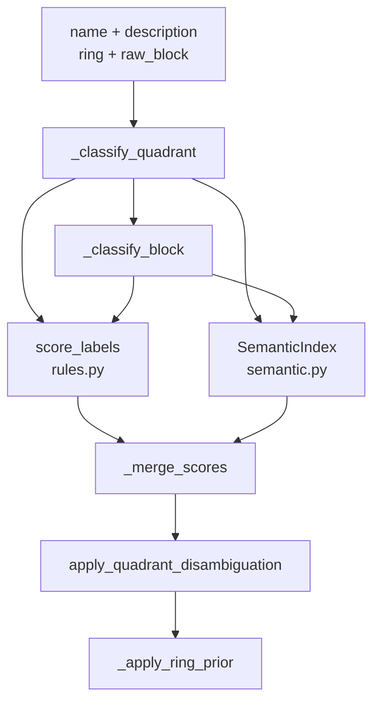
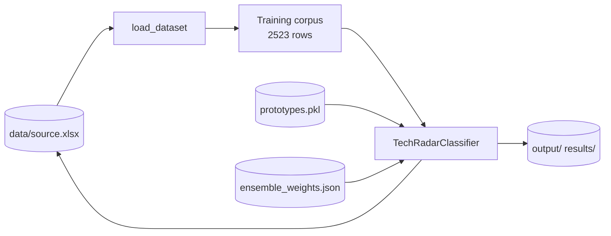
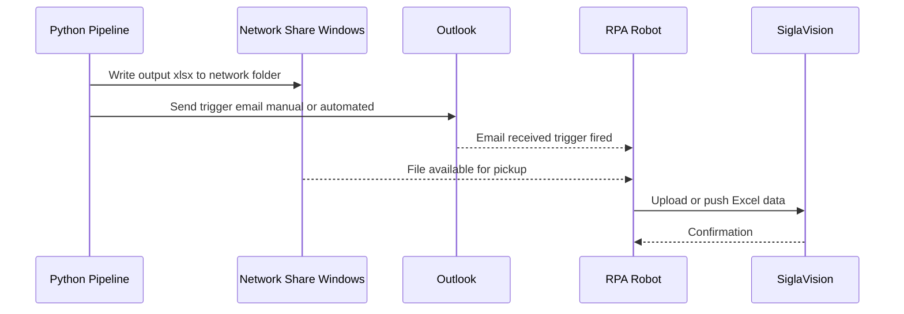

# System Architecture (Architect View)

## Logical Architecture

| Component | File(s) | Responsibility |
|-----------|---------|----------------|
| Orchestrator | `classifier.py` | Lifecycle, ensemble, two-pass quadrant refinement, warnings |
| Rule engine | `rules.py` | Keyword scoring, priority regex, disambiguation, canonical labels |
| Semantic index | `semantic.py` | Encode text, prototype centroids, top-k cosine ranking |
| Data & metrics | `evaluate.py` | Load/filter dataset, split, F1, Excel export, weight optimization |
| Artifacts | `models/` | `ensemble_weights.json`, `prototypes.pkl` |
| CLI scripts | `scripts/` | Batch ops, merge, retune, spot-check |

> 💬 **RU:** Логическая архитектура — шесть компонентов без отдельного «сервисного слоя». Orchestrator (`classifier.py`) — единственная точка, где rule и semantic сходятся. Artifacts в `models/` — persisted state между запусками; их версионирование сейчас только через git и backup-файлы. При проектировании интеграций считайте `TechRadarClassifier` монолитным Python-модулем, а не распределённой системой.

---

## Entry Points

| Entry | Command / API | Purpose |
|-------|---------------|---------|
| Library | `TechRadarClassifier(...).classify(...)` | Primary inference API |
| Evaluate CLI | `python classifier.py --evaluate --stratify=multi` | Hold-out metrics + optional export |
| Rebuild prototypes | `python semantic.py --rebuild` | Regenerate `prototypes.pkl` |
| Retune weights | `python scripts/retune_from_manual.py` | Grid search + save weights |
| Update source | `python scripts/update_source_xlsx.py` | Write predictions to Excel |

**Status:** REST/API endpoints not present in codebase.

> 💬 **RU:** Точки входа — library API и CLI. HTTP API отсутствует (не inference, а факт по коду). Для production-serving потребуется thin wrapper (FastAPI/Flask) вокруг `classify()`. Evaluate CLI при export пишет в `output/batch_markup.xlsx` — убедитесь, что файл не открыт в Excel.

---

## Component Interactions

> 💬 **RU:** Диаграмма отражает двухэтапную классификацию: сначала quadrant (с disambiguation и ring prior), затем block с hint от predicted quadrant. Block path не использует ring prior. Pass-2 refinement (не показан) повторяет quadrant path с `block_hint`, но **не меняет** predicted label — только confidence. Типичная ошибка отладки: смотреть только block scores, игнорируя неправильный quadrant hint.

---

## Batch Data Flow

> 💬 **RU:** Batch data flow: Excel → filtered corpus → classifier → outputs и обратная запись. Число 2523 строк — текущий размер корпуса после исключения NN-Sputnik из `source_16.06.xlsx` (77 excluded из 2600). При смене source-файла пересчитываются priors, compat matrices и (при rebuild) prototypes. Без rebuild prototypes остаются от прошлого корпуса — silent mismatch.

---

## Deployment and Runtime Assumptions

| Assumption | Detail |
|------------|--------|
| Runtime | Single-process Python 3.10+ |
| Hardware | CPU sufficient; GPU optional via PyTorch |
| Model download | First run pulls HF model weights (network required) |
| State | Stateless inference; state in `models/` + Excel files |
| Concurrency | No locking; avoid parallel writes to same `.xlsx` |
| Default data path | `evaluate.DATA_PATH` → `data/source.xlsx` |

> 💬 **RU:** Deployment — single-process batch/CLI. Нет горизонтального масштабирования, очередей, health checks. Первый запуск `TechRadarClassifier()` загружает transformer — инициализация 10–30 сек. Параллельная запись в один `.xlsx` не защищена. Default `DATA_PATH` — `source.xlsx`; retune hardcoded на `source_16.06.xlsx` в `retune_from_manual.py`.

---

## Integration Layer

The Python pipeline operates as a **producer**. All downstream processing is handled by external systems outside the Python codebase.

> 💬 **RU:** Integration Layer — граница ответственности: Python только производит Excel и (опционально) кладёт его в `output/`. Всё после сетевой папки — вне scope Python-команды. Не добавляйте RPA/SiglaVision logic в `classifier.py` без ADR и согласования с владельцами робота.

### Data Flow: Python → RPA → SiglaVision

> 💬 **RU:** Sequence-диаграмма показывает порядок событий после завершения Python pipeline. Важно: Python pipeline сам по себе не управляет RPA — он только кладёт файл в сетевую папку (шаг копирования выполняется вне repo или оператором). Запуск RPA инициируется письмом через Outlook. Если нужна автоматическая отправка письма из Python — потребуется отдельный модуль (`smtplib` или `win32com.client`), зафиксируйте как ADR (см. [ADR-0004](../decisions/0004-rpa-trigger-via-outlook.md)).

### Integration Responsibilities

| Boundary | Owner | Notes |
|----------|-------|-------|
| Output Excel schema | Python pipeline | Any schema change breaks downstream |
| Network folder path | Infrastructure / IT | Path must be stable; changes require RPA reconfiguration |
| Outlook trigger | Operator / Automation | Manual send or scheduled task |
| RPA robot logic | RPA team | Outside Python codebase scope |
| SiglaVision config | BI team | Dashboard mapping tied to Excel column names |

> 💬 **RU:** Таблица ответственностей критична для сопровождения. Python-команда владеет только схемой выходного Excel. Всё правее сетевой папки — другие команды. При сбоях дашборда: (1) изменилась ли схема Excel? (2) пришло ли триггерное письмо? (3) доступна ли сетевая папка? TODO: зафиксировать UNC path и контакты RPA/BI в runbook.

---

## Integrations

| Integration | Type | Notes |
|-------------|------|-------|
| Excel workbook | File I/O | Sheet «Build your Technology Radar» + reference sheets |
| HuggingFace Hub | Model download | `paraphrase-multilingual-mpnet-base-v2` |
| Manual markup file | File merge | `compare_and_update.py` — manual wins |
| Windows network share | File drop | Output `.xlsx` copied after pipeline (path external) |
| Outlook | Email trigger | Outgoing message starts RPA robot |
| RPA robot | Automation | Picks file from share → SiglaVision |
| SiglaVision | BI dashboard | Renders analytics from uploaded Excel |

See also: [data-contracts.md](data-contracts.md), [../backend/pipeline.md](../backend/pipeline.md), [Integration Layer](#integration-layer).

> 💬 **RU:** Таблица Integrations дополнена downstream-компонентами. Upstream (Excel, HF) — in-repo; downstream (share, Outlook, RPA, SiglaVision) — external. Sheet `Block` используется для process codes. Любое изменение `export_batch_to_excel` columns согласуйте с BI до merge в main.
