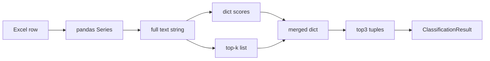

# Deep Dive: Data Between Layers

How data structures transform from Excel to `ClassificationResult` and where context is lost.

> 💬 **RU:** Deep dive для backend-инженера: что именно передаётся между слоями и где теряется контекст (ring не в embeddings, compat matrix zeroes labels, etc.). Читайте перед refactor merge logic или добавлением новых DTO.

---

## Layer Mapping

| Logical layer | Python module | Primary structures |
|---------------|---------------|-------------------|
| Source / I/O | `evaluate.py`, `scripts/*` | pandas DataFrame, openpyxl rows |
| Normalization | `rules.py` | `normalize_text`, `canonical_quadrant/block` |
| Feature text | `rules.build_weighted_text` | `(name_n, desc_n, full_text)` |
| Rule scores | `rules.score_labels` | `dict[label, float]` |
| Semantic ranks | `semantic.SemanticIndex.classify` | `list[tuple[label, prob]]` |
| Ensemble | `classifier._merge_scores` | normalized `dict[label, float]` |
| Post-process | disambiguation, ring prior | mutated score dict |
| Output DTO | `ClassificationResult` | dataclass |

**Status:** No separate Pydantic schemas — dicts and dataclass used directly.

> 💬 **RU:** Mapping показывает, что нет классического Controller→Service→Repository. «Repository» ≈ `evaluate.load_dataset`; «Service» ≈ `classifier.py`; «Domain» ≈ `rules.py`. Anti-corruption — функции `canonical_*` и `normalize_block`. При добавлении API layer рекомендуется Pydantic wrapper вокруг `ClassificationResult`, не меняя core.

---

## Transformation Chain

> 💬 **RU:** Chain от Excel до Result. Критичные forks: Text идёт в rule и semantic параллельно; merge — единственная точка fusion. Ranked top3 — display only; argmax on full merged dict. Context loss начинается после merge (compat, disambiguation mutate dict in place).

---

## Stage Details

### Excel → DataFrame

Types may be float NaN. `type & category` not passed to classifier.

> 💬 **RU:** NaN handling: scripts use `pd.notna` and `str(...)`. Duplicate names (33 in source) — last wins in merge scripts; may hide data issues. Always validate row count after merge (2600 expected).

### Training corpus filter

Drops NN-Sputnik, invalid labels, empty names.

> 💬 **RU:** Filter shrinks corpus — old 1334 NN-Sputnik excluded vs 77 in current manual file. Training corpus size directly affects priors and prototypes — document corpus size in retune metrics JSON.

### Weighted text

Name weighted 0.55 / desc 0.45 in keyword hits; semantic uses `full` only.

> 💬 **RU:** Title emphasis только в rule layer. Long descriptions dominate semantic embedding — short names with rich descriptions behave differently than keyword rules expect. Consider concatenating ring to text — TODO not implemented.

### Rule layer output

Sparse dict; priority regex sets fixed high scores (0.84–0.95).

> 💬 **RU:** Rule scores not probabilities — merge treats them comparable to semantic probs heuristically. High priority regex false positive — hard to override without disambiguation rule.

### Semantic layer output

Cosine → clip → normalize → top-3 only in result.

> 💬 **RU:** Tail classes invisible in top3 — use `semantic.classify(..., top_k=5)` in REPL for debug. Empty training class → prototype from label string only — weak semantic signal.

### Ensemble merge

Adaptive weights + prior + compat exponents. Conflict detection forces ensemble method.

> 💬 **RU:** `_merge_scores` — most complex stage. Compat row from block_hint can zero import label (Directum case before iter 4 fix). Priors suppress rare classes — good for accuracy, bad for rare class recall.

### Post-processing (quadrant)

Order: disambiguation → ring prior.

> 💬 **RU:** Order matters — swap breaks RU Directum behavior. veto_rings on СЭД rule — ring must be normalized via `normalize_ring`.

### Pass-2 refinement

`block_hint` compat; label must not change.

> 💬 **RU:** Pass-2 only boosts confidence same label — architectural guard from iter 4. Do not remove guard without re-testing Directum RU ring case.

---

## Anti-Corruption Boundaries

| Boundary | Mechanism |
|----------|-----------|
| Raw Excel block → canonical | `canonical_block`, `BLOCK_ALIASES`, fuzzy match |
| Typo quadrant | `QUADRANT_ALIASES` |
| NN-Sputnik | separate train vs infer policy |
| Manual vs auto | `compare_and_update.py` manual wins |

> 💬 **RU:** Boundaries prevent raw Excel typos from breaking training. Fuzzy block match threshold 0.72 — tune carefully. Manual wins — business invariant; automating override requires ADR.

---

## Problem Hotspots

| Location | Symptom | Cause |
|----------|---------|-------|
| `_merge_scores` + compat | Wrong quadrant after pass-2 | Sharp block–quadrant matrix |
| Missing `ring` in batch | Wrong disambiguation | Caller omitted column |
| NN-Sputnik training gap | Low block confidence | Block not in training labels |
| Duplicate `name` keys | Non-deterministic merge | 33 duplicates — last wins |
| Macro F1 rare blocks | F1=0 in test | sklearn macro over 16 labels |

> 💬 **RU:** Hotspots — первые места для debugging production issues. Missing ring — #1 batch bug. Duplicate names — dedupe policy undocumented for analysts. Macro F1 misleading for blocks — also track per-class confusion from evaluate export.

See [../ml-ai/ranking-filtering.md](../ml-ai/ranking-filtering.md).
