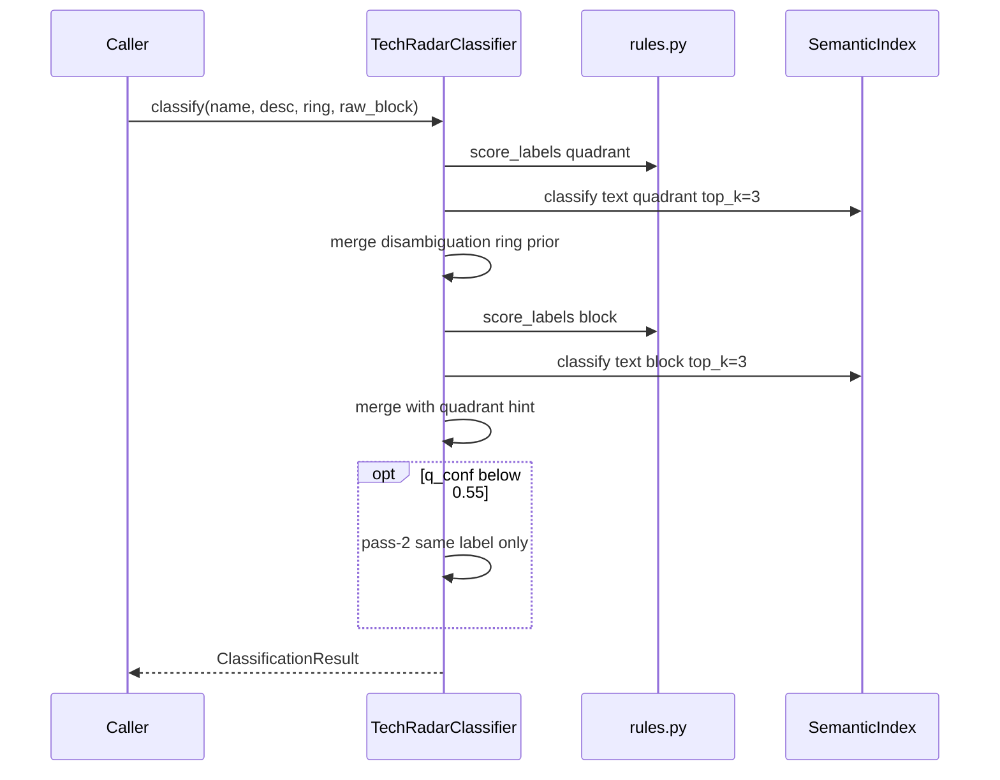
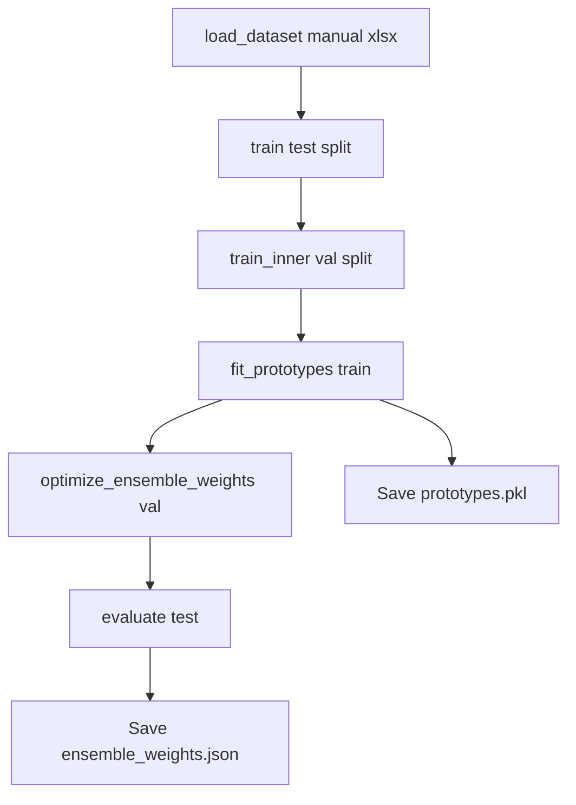

# Processing Pipeline

End-to-end flows for training, inference, evaluation, and Excel sync.

> 💬 **RU:** Документ описывает все pipeline end-to-end — от загрузки Excel до write-back. Используйте таблицу этапов как checklist при onboarding нового data steward: какой скрипт за что отвечает и в каком порядке запускать после изменения разметки.

---

## Pipeline Stages Overview

| Stage | Component | Input | Output | Notes |
|-------|-----------|-------|--------|-------|
| 1. Load raw | `evaluate.load_dataset` | `data/source.xlsx` | DataFrame corpus | In-repo |
| 2. Filter | `exclude_nn_sputnik_rows` | Raw rows | Rows without NN-Sputnik block | In-repo |
| 3. Canonicalize | `build_training_corpus` | Filtered rows | `name, text, quadrant, block, ring` | In-repo |
| 4. Build prototypes | `SemanticIndex.build_from_dataframe` | Train corpus | `models/prototypes.pkl` | In-repo |
| 5. Tune weights | `optimize_ensemble_weights` | Val split | `models/ensemble_weights.json` | In-repo |
| 6. Inference | `TechRadarClassifier.classify` | name + description + ring + raw_block | `ClassificationResult` | In-repo |
| 7. Export / sync | scripts / `export_batch_to_excel` | Predictions | `output/`, updated `source.xlsx` | In-repo |
| 8. Write to network share | OS / file system | `output/*.xlsx` | Windows network folder | Path configured externally (TODO: UNC) |
| 9. Email trigger | Outlook | — | Trigger email sent | Initiates RPA robot; manual or automated |
| 10. RPA processing | RPA Robot (external) | Network folder file | SiglaVision upload | Outside Python scope |
| 11. Dashboard render | SiglaVision (external) | Uploaded data | BI dashboard | Outside Python scope |

> 💬 **RU:** Этапы 1–7 — Python pipeline in-repo. Этапы 8–11 — downstream вне Python-кода, но включены для сквозной картины. Если pipeline OK, а дашборд stale — проверяйте (1) файл в share, (2) триггерное письмо, (3) логи RPA. Stage 7 output schema changes require RPA/BI sign-off.

---

## Inference Pipeline (In-Process)

**Status:** «Online» = in-process Python call; no network service.

> 💬 **RU:** Sequence diagram inference path. Обратите внимание на opt block — pass-2 conditional. Caller must pass ring for correct disambiguation. No retry on failure — exceptions propagate. Batch callers should catch PermissionError separately when writing Excel.

---

## Training / Retune Pipeline (Offline)

Script: `scripts/retune_from_manual.py`  
Data: `data/source_16.06.xlsx`

> 💬 **RU:** Retune pipeline на manual reference. Inner val split для grid search weights; test hold-out для final metrics in JSON. Full corpus rebuild (post-retune step) improves prototypes — see `prototypes_trained_on` in weights file. Runtime ~13 min on CPU for full retune — plan accordingly.

---

## Batch Reclassification Pipeline

Script: `scripts/reclassify_batch.py`

1. Read `output/batch_markup.xlsx` sheet «Разметка».
2. Merge `block`, `ring` from `data/source.xlsx`.
3. Run `export_batch_to_excel` → write predictions.

> 💬 **RU:** Reclassify batch — когда analysts обновили descriptions в batch_markup. Merge ring/block from source critical. Output default `batch_markup_v4.xlsx` via `--output`. Compare changed counts printed at end — 0 changes may mean rules already applied or stale input.

---

## Source Sync Pipelines

### Auto predictions → source

`scripts/update_source_xlsx.py`: backup → classify 2600 rows → openpyxl update quadrant/block only → verify other sheets → `low_confidence_records.csv`.

> 💬 **RU:** Auto write-back — classifier wins. NN-Sputnik block preserved if conf < 0.5. Always close Excel before run. Verify step compares snapshot other sheets — regression if someone uses pandas ExcelWriter on full workbook.

### Manual wins → source

`scripts/compare_and_update.py`: diff report → backup → overwrite from manual lookup.

> 💬 **RU:** Manual merge — authoritative human labels. Produces `output/diff_report.xlsx` with color coding. 47 mismatches (~1.8%) was last known diff rate — use «Расхождения» sheet for rule tuning targets.

---

## Evaluation Pipeline

`python classifier.py --evaluate --stratify=multi`: split 20% → rebuild prototypes on train → metrics → save JSON → optional export batch_markup.

> 💬 **RU:** Evaluation rebuilds prototypes on train split each run — metrics not comparable to production full-corpus prototypes unless you align rebuild policy. Stratify multi = quadrant+block combo — better for rare pairs. Export may fail if batch_markup.xlsx open.

---

## Failure Handling

| Failure | Behavior |
|---------|----------|
| Missing `prototypes.pkl` | Auto-build if `rebuild_prototypes=True` or cache missing |
| HF model download fail | Fallback to MiniLM in `semantic.py` |
| Excel PermissionError | Save fails — close file and retry |
| Empty name | Skipped in training; may get defaults at inference |

**Status:** No retry queue or dead-letter — failures surface to console/exception.

> 💬 **RU:** Failure handling minimal — no Celery/Airflow retry. PermissionError most common ops issue. HF fallback changes embedding space — must rebuild prototypes after fallback trigger. Empty descriptions common in source — fill in batch_markup for spot_check accuracy.

---

## Orchestration

No scheduler/DAG in repository. Pipelines invoked manually via CLI.

**TODO:** Document CI job if `pytest tests/` runs in pipeline.

> 💬 **RU:** Orchestration — fully manual. Recommended runbook: pytest → spot_check → evaluate → update_source (if approved) → copy to network share → send Outlook trigger. TODO CI — `.pytest_cache` exists but no GitHub Actions yaml found in repo (Status: inferred).

---

## Downstream Failure Scenarios

| Symptom | Likely Cause | Action |
|---------|-------------|--------|
| Dashboard not updated | File not in network share | Check `output/` folder and file copy step |
| Dashboard not updated | Trigger email not sent | Verify Outlook send, check spam/block rules |
| Dashboard not updated | RPA robot not triggered | Contact RPA team, check robot logs |
| Dashboard shows wrong data | Excel schema changed | Compare current output columns with SiglaVision mapping |
| Dashboard not updated | SiglaVision config broken | Contact BI team |

> 💬 **RU:** Первая точка диагностики при инцидентах downstream. Самая частая причина — изменение структуры выходного Excel без уведомления RPA/BI. Вторая — триггерное письмо не отправлено. Не меняйте Python, пока не исключите шаги 8–10. Добавляйте новые сценарии по мере эксплуатации.
