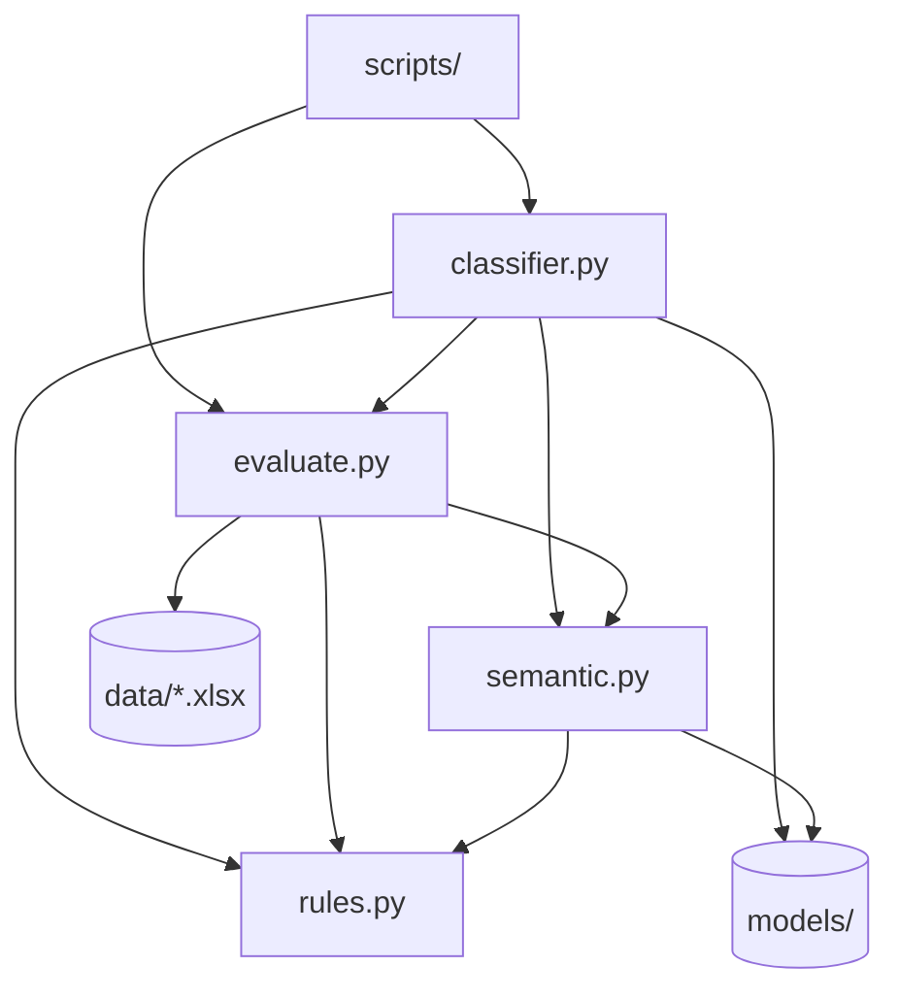

# Backend System Architecture

> **Note:** This project has no web backend (no FastAPI/Django/REST). «Backend» here means the **Python application layer**: modules, scripts, and pipeline I/O.

> 💬 **RU:** Раздел «Backend» в этом проекте — не микросервисы, а Python-модули и CLI. Не ищите controllers/repositories в классическом смысле: слои ниже mapped на `classifier.py`, `rules.py`, `evaluate.py`, `scripts/`. Если вы backend-разработчик из web — думайте «application layer + batch jobs».

---

## Module Layers

| Layer | Path | Role |
|-------|------|------|
| Application API | `classifier.py` | Public interface: `TechRadarClassifier`, CLI `main()` |
| Domain rules | `rules.py` | Pure functions: scoring, normalization, disambiguation |
| ML inference | `semantic.py` | Embedding encode + prototype classify |
| Infrastructure | `evaluate.py` | Data access, metrics, Excel export, tuning |
| Jobs / CLI | `scripts/*.py` | One-off and batch operations |
| Tests | `tests/test_classifier.py` | Regression |

> 💬 **RU:** Шесть слоёв — flat Python package без packages/subfolders для core logic. Domain rules intentionally pure (no I/O) — unit-test friendly. Infrastructure (`evaluate.py`) знает про Excel и sklearn — не importируйте тяжёлые deps в `rules.py`. Scripts — thin wrappers; business logic держите в core modules.

---

## Single `classify()` Lifecycle

1. **Init** (`TechRadarClassifier.__init__`): load weights, dataset priors, compat matrices, prototypes.
2. **Quadrant path**: rule scores → semantic top-3 → merge → disambiguation → ring prior → ranking.
3. **Block path**: rule scores → process boost → disambiguate → semantic → merge with quadrant hint.
4. **Pass-2** (optional): if `q_conf < 0.55`, repeat quadrant with `block_hint` (same label only).
5. **Output**: `ClassificationResult` + warnings. No persistence unless caller writes Excel.

> 💬 **RU:** Lifecycle одного вызова `classify()` — synchronous, single-threaded. Init дорогой (model load); reuse один instance of `TechRadarClassifier` в batch loops. Pass-2 не меняет label — только confidence; не ожидайте «исправления» wrong quadrant через pass-2. Warnings always inspect in batch export.

---

## Layer Dependencies

> 💬 **RU:** Диаграмма зависимостей: `semantic.py` imports only label helpers from `rules.py`; `classifier.py` — hub. Circular imports avoided: `evaluate.py` imports `TechRadarClassifier` only under TYPE_CHECKING. При добавлении нового script — insert ROOT in sys.path как в existing scripts (`parents[1]`).

---

## Directory Map

| Task | Look in |
|------|---------|
| Change keyword / disambiguation | `rules.py` |
| Change merge / ring prior | `classifier.py` |
| Change embedding model | `semantic.py` (`DEFAULT_MODEL`) |
| Change train/test split | `evaluate.py` → `train_test_split_df` |
| Change Excel export format | `evaluate.py` → `export_batch_to_excel` |
| Write back to source | `scripts/update_source_xlsx.py` |
| Merge manual labels | `scripts/compare_and_update.py` |

> 💬 **RU:** Directory map — шпаргалка «куда лезть». 80% tuning — `rules.py` keywords и `DISAMBIGUATION_RULES`. Merge logic — только `classifier.py`. Не правьте `evaluate.py` export columns без sync batch consumers. Excel write-back always через openpyxl scripts, не pandas ExcelWriter для source (теряются другие листы).

---

## Technical Constraints

- **Circular imports:** `evaluate.py` lazy-imports classifier in functions.
- **Heavy init:** First `TechRadarClassifier()` loads transformer (~ hundreds MB).
- **Single-threaded batch:** `classify_batch` uses `iterrows` — no parallelism.
- **Windows:** Use `python -X utf8` for Cyrillic console output.

> 💬 **RU:** Constraints важны для performance planning: 2600 rows batch ~ несколько минут на CPU. Parallelism TODO not implemented. На Windows cp1251 console garbles `[load_dataset]` messages — UTF-8 content in files is fine. Heavy init — warm up classifier once per process.

---

## CLI Reference

| Script | Usage |
|--------|-------|
| `classifier.py` | `--evaluate`, `--stratify multi\|quadrant`, `--rebuild-prototypes` |
| `semantic.py` | `--rebuild`, `--data PATH` |
| `scripts/spot_check.py` | `--records "Name1,Name2"` |
| `scripts/reclassify_batch.py` | `--input`, `--output` |
| `scripts/update_source_xlsx.py` | no args |
| `scripts/compare_and_update.py` | no args |
| `scripts/retune_from_manual.py` | no args |

> 💬 **RU:** CLI reference — все operational entry points. Перед `update_source_xlsx` и `compare_and_update` создаётся backup — проверяйте `data/source_backup*.xlsx`. `spot_check` merges descriptions from `batch_markup.xlsx` if present — иначе short source descriptions дадут weak predictions.

See [pipeline.md](pipeline.md).
