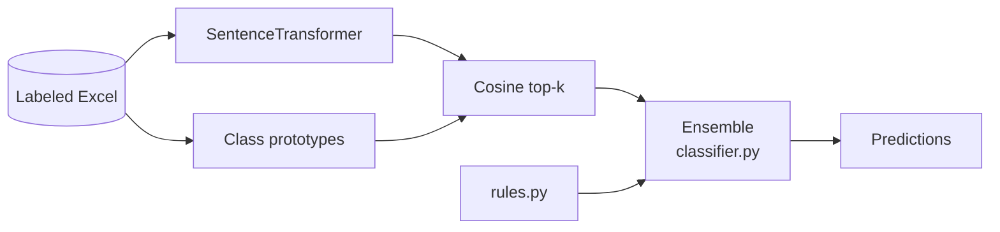

# ML/AI Layer — Architecture Position

## Role

The ML/AI layer provides **dense semantic similarity** over scenario text, complementing the deterministic rule layer. Not a generative LLM stack — no prompts, RAG, or vector DB.

> 💬 **RU:** ML-слой — sentence embeddings + prototype matching, не LLM. Это важно для ожиданий stakeholders: система не «понимает» текст как ChatGPT, а сравнивает с центроидами классов из обучающих примеров. Качество semantic path напрямую зависит от полноты descriptions в Excel.

---

## Layer Comparison

| Layer | Technology | Output |
|-------|------------|--------|
| Rule | Keywords + regex | Per-label scores |
| **Semantic (ML)** | Sentence-transformers | Top-k class probabilities |
| Ensemble | Weighted fusion | Final quadrant + block |

> 💬 **RU:** Rule layer быстрый и интерпретируемый; semantic — для synonym-rich и ambiguous text. Current weights (quadrant rule 0.1) mean semantic dominates quadrant path after adaptive merge. Block still uses more rule (0.3) — aligns with keyword-rich org block names.

---

## Upstream / Downstream

| Direction | Items |
|-----------|--------|
| **Upstream** | Labeled Excel corpus, `name`+`description` text, optional `ring`/`raw_block` for rules only |
| **Downstream** | `classify()`, batch export, `update_source_xlsx`, `evaluate()` metrics |

> 💬 **RU:** Upstream quality = manual markup in source_16.06. Downstream consumers assume `ClassificationResult` schema stable. Changing top_k or confidence formula breaks Excel export column semantics — coordinate with evaluate.py.

---

## Online vs Offline

| Path | Actions |
|------|---------|
| **Offline** | `semantic.py --rebuild`, `retune_from_manual.py` |
| **Online** | Every `classify()` — load model, encode, cosine vs prototypes |

Same `SemanticIndex` class for both — no separate serving artifact.

> 💬 **RU:** Offline rebuild обязателен после изменения labels или corpus. Online path loads pickle prototypes — mismatch model_name vs current DEFAULT_MODEL causes silent wrong space if pickle stale.

---

## Extension Points

| Extension | Where |
|-----------|--------|
| New embedding model | `semantic.DEFAULT_MODEL`, rebuild prototypes |
| New class label | `QUADRANT_LABELS`/`BLOCK_LABELS`, rebuild |
| New domain rule | `DISAMBIGUATION_RULES` — no retrain required |
| Fine-tuned classifier | **TODO:** not implemented |

> 💬 **RU:** Extension without retrain — rules/disambiguation. Any embedding model change — full rebuild + retune recommended. Cross-encoder reranker on top-5 — future ADR candidate.

---

## Position Diagram

> 💬 **RU:** AI layer между labeled data и ensemble. RulesCfg bypasses embedding but fuses at ensemble — not a pipeline fork. Proto built from same Excel as rules training corpus (filtered). For debugging: isolate semantic by `clf.set_ensemble_weights(quadrant=0.0, block=0.0)` — forces semantic-heavy adaptive path.

See [ml-models.md](ml-models.md), [ranking-filtering.md](ranking-filtering.md).
