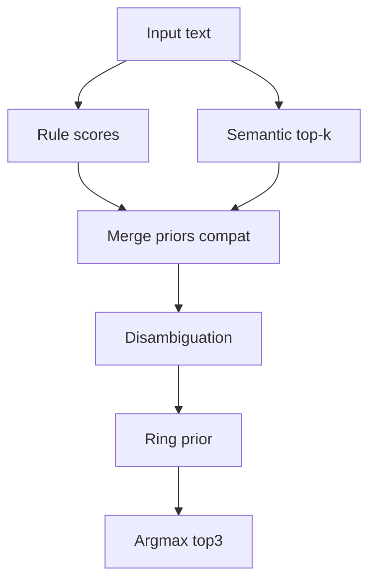

# Ranking and Filtering

Scoring order, rule vs model components, relevance parameters, debugging.

> 💬 **RU:** Canonical doc для порядка scoring. При tuning начинайте с trace одного продукта через все steps — spot_check + REPL `score_labels` / `semantic.classify`. Changing order of disambiguation vs ring prior breaks iteration 4 fixes.

---

## Quadrant Pipeline Order

| Step | Component | Type |
|------|-----------|------|
| 1 | `score_labels` + priority regex | Rule |
| 2 | `SemanticIndex.classify(quadrant)` | Model |
| 3 | `_merge_scores` | Ensemble |
| 4 | `apply_quadrant_disambiguation` | Rule |
| 5 | `_apply_ring_prior` | Metadata rule |
| 6 | `scores_to_ranking` | Rank |
| 7 | Confidence assembly | Heuristic |

Optional pass-2 if `q_conf < 0.55` (same label only).

> 💬 **RU:** Seven steps quadrant path. Steps 4–5 only quadrant — block skips them. Pass-2 re-runs 1–6 with compat from predicted block — guard prevents label flip. Confidence step 7 takes max of rule/semantic/merged + ring boost — not same as ranking score.

---

## Block Pipeline Order

| Step | Component | Type |
|------|-----------|------|
| 1 | `score_labels` + `BLOCK_PRIORITY_RULES` | Rule |
| 2 | `apply_process_code_boost` | Rule |
| 3 | `disambiguate_blocks` | Rule |
| 4 | `SemanticIndex.classify(block)` | Model |
| 5 | `_merge_scores` + quadrant compat | Ensemble |
| 6 | `scores_to_ranking` | Rank |

> 💬 **RU:** Block path uses quadrant_hint compat row — wrong quadrant poisons block. Fix quadrant first. disambiguate_blocks caps production fallback confidence — watch warning `production_block_fallback`.

---

## Rule Scoring

Keyword hits: `0.35 + (0.55*name_hits + 0.45*desc_hits) * 0.12`, cap 0.98.

Priority regex on name: weight × 1.05.

Disambiguation: target ≥ 0.85; overrides × 0.45.

Rules: `СЭД_ECM_to_integration`, `BI_planning_to_integration`, `mining_to_prom_automation`.

> 💬 **RU:** Rule scores heuristic not probabilistic. Disambiguation hard-sets target 0.85 — strong override. mining rule sends MineManager to prom automation. Adding keywords cheaper than retrain — try rules before weights tune.

---

## Model Scoring

Cosine similarity → clip negatives → normalize to probability mass → top-k.

Prototypes = mean embedding of training texts per class.

> 💬 **RU:** Semantic «probability» — renormalized cosine, not softmax from classifier head. Classes with similar prototypes compete — check confusion pairs in evaluate export.

---

## Ensemble Parameters

Current tuned weights (`ensemble_weights.json`):
- quadrant rule: **0.1**
- block rule: **0.3**

Adaptive override: rule_conf ≥ 0.8 → 90% rule; rule_conf < 0.5 → 10% rule.

Prior exponent 0.35; compat exponent 0.25–0.35 on conflict.

> 💬 **RU:** Static weights from JSON interact with adaptive `_resolve_ensemble_weights` — effective mix varies per sample. Grid search on val split — retune after corpus shift. Don't set both quadrant and block to 0.0 expecting pure semantic — adaptive floor applies.

---

## Debugging Checklist

1. `python scripts/spot_check.py --records "ProductName"`
2. Inspect `quadrant_top3`, `block_top3`, `classification_method`
3. Check warnings (low conf, layer conflict)
4. REPL: `score_labels(...)`, `clf.semantic.classify(text, top_k=5)`
5. Ablation: `clf.set_ensemble_weights(quadrant=0.9, block=0.9)`

> 💬 **RU:** Checklist — standard ML debug workflow for this project. Layer conflict warning → rule and semantic disagree — inspect both top-1. Ablation with high rule weight tests keyword coverage without retraining.

---

## Ranking Flow Diagram

> 💬 **RU:** Diagram quadrant-only (D and R absent on block path). Merge sits before disambiguation — disambiguation operates on fused scores not raw rule scores. Editing this order in code requires re-run full boundary tests and Directum/PlanDesigner spot checks.

See [ml-models.md](ml-models.md).
