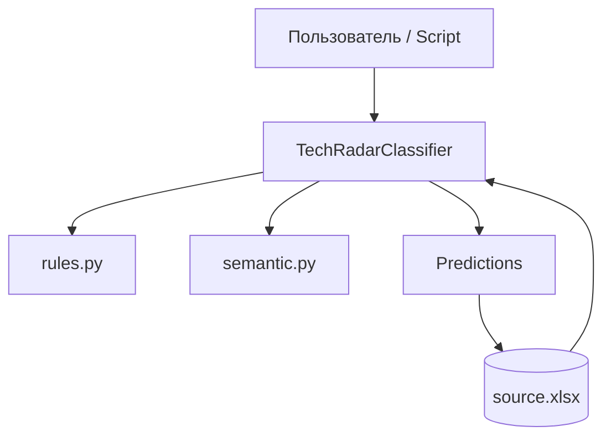
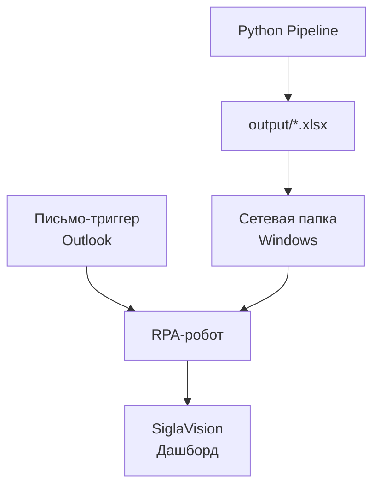

# Overview Architecture

> 💬 **RU:** Упрощённый обзор для первого знакомства. После прочтения откройте [cheat-sheet.md](cheat-sheet.md) и запустите spot_check на одном продукте.

---

## Problem

Каждый сценарий Technology Radar нужно отнести к **технологическому квадранту** и **блоку процессов**. Сценариев сотни; тексты на русском и английском, домены разные (IoT, СЭД, горнодобыча, BI…).

> 💬 **RU:** Проблема — масштаб ручной разметки и неоднородность формулировок. Один и тот же продукт может описываться по-разному; таксономия строгая (24+16 классов). Ошибка quadrant часто тянет ошибку block через compatibility hint.

---

## Solution

Гибридный классификатор: **правила по ключевым словам** + **семантическая близость** к прототипам классов, объединённые настраиваемыми весами из `ensemble_weights.json`.

> 💬 **RU:** Hybrid — не «только ML». Rules дают высокую точность на явных маркерах (LLM, blockchain, SCADA). Semantic ловит перефразирования. Ensemble weights (сейчас quadrant semantic-heavy 0.1 rule) подобраны grid search на manual corpus.

---

## Main Parts

| Часть | Что делает | Файл |
|-------|------------|------|
| Rules | «Если в тексте X → класс Y» | `rules.py` |
| Semantic | «Текст похож на примеры класса Z» | `semantic.py` |
| Brain | Склеивает сигналы, ring, подсказки | `classifier.py` |
| Data | Excel, метрики | `evaluate.py` |
| Tools | Пакетные операции | `scripts/` |

> 💬 **RU:** Пять частей — весь проект. Brain (`classifier.py`) — не редактируйте keywords там. Tools — orchestration only. Data layer знает про NN-Sputnik filter и stratified split.

---

## Simple Data Flow

1. **Excel** хранит сценарии.
2. **Training:** строки (без NN-Sputnik) → prototypes + statistics.
3. **Inference:** текст → rules + semantic → ответ + confidence.
4. **Review:** низкий confidence → CSV/Excel → ручная правка → merge.

> 💬 **RU:** Closed loop: predictions могут вернуться в source через scripts. Manual reference (`source_16.06.xlsx`) — gold для retune и merge. Не skip review step для low-conf — иначе error propagation в radar.

---

## Two-Level Prediction

Сначала **quadrant**, затем **block** с подсказкой от quadrant (compatibility matrix). Два отдельных ensemble merge — разные weights для quadrant и block.

> 💬 **RU:** Two-level — архитектурное решение ADR-0001. Нельзя предсказывать block без quadrant hint в текущей реализации. Ошибка quadrant → часто ошибка block даже при хорошем block layer.

---

## Backend vs ML

| | Backend (Python modules) | ML layer |
|---|--------------------------|----------|
| **Что** | Excel I/O, scripts, orchestration | Sentence-transformers, prototypes |
| **Когда силён** | Pipeline, merge, write-back | Ambiguous text, synonyms |
| **Конфиг** | scripts, evaluate | `prototypes.pkl`, HF model |

Отдельного microservice нет — один Python process.

> 💬 **RU:** «Backend» здесь — application code, не REST server. ML layer — embeddings only, not LLM. Для production API нужен thin wrapper — out of scope текущего repo.

---

## Starter Diagram

> 💬 **RU:** Диаграмма: пользователь или script вызывает классификатор; Excel — input и optional output. Rules и ML — параллельные subpaths внутри classify. Стрелка Out → XLSX — `update_source_xlsx.py` / `compare_and_update.py`. Легенда символов — [diagram-legends-index.md](diagram-legends-index.md).

---

## Куда уходит результат

После того как Python pipeline завершает работу:

1. **Excel-файл** записывается в папку `output/` проекта.
2. **Файл копируется** в сетевую папку Windows (путь настраивается вне кода — TODO: UNC).
3. **Оператор** (или автоматизация) **отправляет письмо через Outlook** — это триггер для RPA-робота.
4. **RPA-робот** забирает файл из сетевой папки и загружает данные в **SiglaVision**.
5. **SiglaVision** отображает обновлённый дашборд для аналитиков.

> 💬 **RU:** Python-код отвечает только за генерацию Excel в `output/`. Всё после — другие системы и команды. Если дашборд сломался — пройди цепочку: файл → share → письмо → RPA → SiglaVision. Самое уязвимое место — структура Excel: переименование колонки ломает весь downstream. Согласуй изменения export с RPA и BI заранее (см. ADR-0004).

---

## Next Steps

1. `pytest tests/test_classifier.py`
2. [cheat-sheet.md](cheat-sheet.md)
3. [diagram-legends-index.md](diagram-legends-index.md)
4. Deep dive: [../backend/pipeline.md](../backend/pipeline.md) или [../ml-ai/architecture-position.md](../ml-ai/architecture-position.md)

> 💬 **RU:** Next steps — практика. После pytest запустите spot_check на Directum (RU ring vs Внедряется) чтобы увидеть ring prior и disambiguation в действии. Затем выберите track по роли из docs/README.md.
